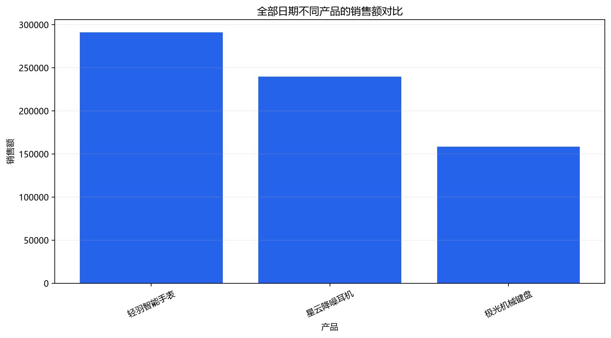
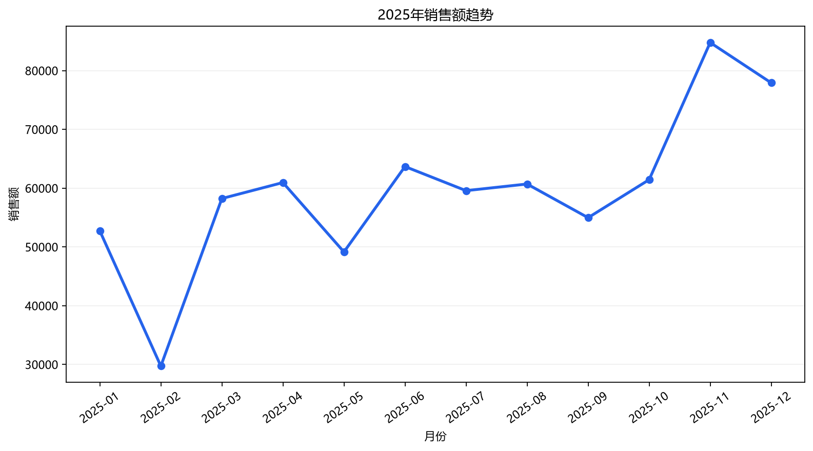
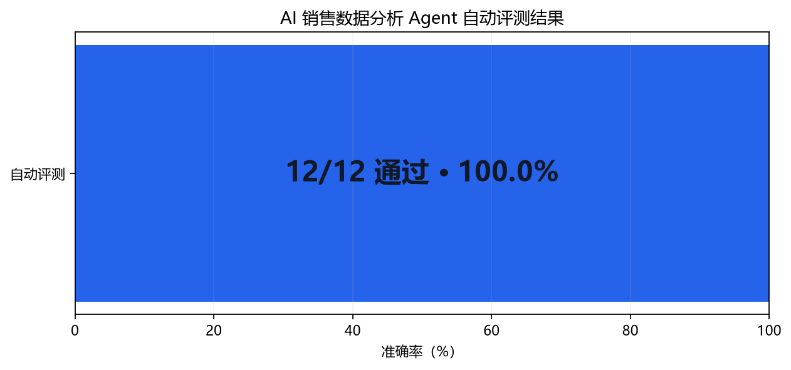

# AI 销售数据分析 Agent

一个可以直接读取 Excel/CSV 销售数据、理解中文问题、执行真实计算、自动纠错并生成图表的数据分析 Agent。

AI 只负责理解问题和制定受控计划；所有销售额、利润、折扣、排名和趋势数字都由本地程序从数据表计算，不由模型直接生成。

## 功能概览

- 自然语言查询总额、平均值、排名、最低值和分组对比；
- 支持年份、地区和客户类型筛选；
- 展示“理解 → 规划 → 计算 → 检查 → 回答”的完整过程；
- 计算失败后读取错误并自动调整，最多尝试 3 次；
- 外部 AI 不可用时自动切换到本地分析模式；
- 生成产品柱状图、地区对比图和月度趋势图；
- PNG 图片保存在 `charts/`，路径会写入最终答案；
- 内置 12 道自动评测题，逐题判分并保存报告。

## 真实图表示例

### 营收最高的三个产品



### 2025 年月度营收趋势



## Agent 如何运行

```text
读取销售表
   ↓
识别时间、指标、分组、筛选条件和图表需求
   ↓
生成受限制的分析计划
   ↓
执行真实计算并检查结果
   ├─ 正常：生成答案或图表
   └─ 失败：显示错误 → 修正计划 → 重新计算
                              （最多 3 次）
```

分析计划只能使用允许的字段、汇总方法和排序方式，不会执行 AI 随意生成的代码。最终答案固定包含：

```text
- 答案
- 依据
- 一共用了几步
```

页面左侧的“演示一次自动纠错”开关会让第一次计划使用错误字段，用来完整展示错误发现、原因说明和第二次修正成功的过程。

## 可以直接询问

- `去年总营收是多少？`
- `哪个产品营收最低？`
- `营收最高的前三个产品是什么？`
- `哪个地区的平均折扣最高？`
- `2025年哪个产品类别利润最高？`
- `2024年华东地区总营收是多少？`
- `2025年老客户总营收是多少？`
- `营收最高的前三个产品是什么？顺便画张柱状图。`
- `帮我画一下2025年每个月营收趋势。`
- `不同地区的营收对比图。`

## 自动评测

项目内置 12 道题，标准答案由一套独立的 Pandas 计算逻辑生成。评测器会逐题调用 Agent，再比较数字、排名、筛选结果和 PNG 文件。

| 题号 | 能力类型 | 问题 |
|---|---|---|
| Q01 | 总数计算 | 2025年总营收是多少？ |
| Q02 | 找最高或最低 | 哪个产品营收最低？ |
| Q03 | 按地区比较 | 不同地区的营收分别是多少？ |
| Q04 | 按产品比较 | 营收最高的前三个产品是什么？ |
| Q05 | 按月份分析 | 2025年每个月的营收分别是多少？ |
| Q06 | 按客户类型分析 | 哪个客户类型营收最高？ |
| Q07 | 折扣分析 | 哪个地区的平均折扣最高？ |
| Q08 | 利润分析 | 2025年哪个产品类别利润最高？ |
| Q09 | 筛选条件 | 2024年华东地区总营收是多少？ |
| Q10 | 筛选条件 | 2025年老客户总营收是多少？ |
| Q11 | 图表生成 | 营收最高的前三个产品是什么？顺便画张柱状图。 |
| Q12 | 图表生成 | 帮我画一下2025年每个月营收趋势。 |

### 最新评测结果



- 总题数：12
- 通过：12
- 失败：0
- 准确率：100.0%
- 自动回归检查：19 项通过

评测会保存每道题的标准答案、实际结果、判断理由、步骤数、最终回答和完整过程：

- [最新评测报告](evaluation/results/latest_report.md)
- [逐题结果 CSV](evaluation/results/latest_results.csv)
- [完整结果 JSON](evaluation/results/latest_results.json)

如果出现失败，页面和报告会明确列出失败题号及原因。

## 运行方法

Windows 用户双击：

```text
启动项目.bat
```

浏览器通常会自动打开；如果没有，请访问：

```text
http://localhost:8501
```

页面底部点击“运行完整自动评测”，即可自动完成全部题目并查看得分。

也可以双击：

```text
运行自动评测.bat
```

## AI 与本地模式

- 配置 Evolink API Key：AI 把自然语言转换为受控分析计划，本地程序执行计算；
- 不配置 Key：使用内置规则理解常见问题，计算、纠错和图表仍可运行；
- AI 接口失败：显示错误并自动切换到本地模式。

复制 `.env.example` 为 `.env` 后可以填写自己的 Key。`.env` 已被 Git 忽略，不会提交到仓库。

## 数据与项目结构

仓库包含 864 条模拟电商订单，覆盖 2024—2025 年和 12 个产品，不含真实客户信息。

```text
.
├─ app.py                     网页入口
├─ src/analyzer.py            Agent 规划、计算、纠错和绘图核心
├─ evaluation/evaluator.py    题库、独立标准答案和自动判分
├─ evaluation/results/        最新逐题评测结果
├─ data/                      Excel/CSV 模拟销售数据
├─ docs/images/               README 示例图片
├─ charts/                    用户查询生成的图表
├─ tests/                     自动回归检查
├─ run_evaluation.py          命令行评测入口
├─ 运行自动评测.bat           Windows 一键评测
└─ 启动项目.bat               Windows 一键启动
```

主要数据字段：订单日期、地区、产品、产品类别、客户类型、销售额、成本、折扣、数量。
